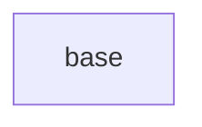

# Code Server Images

## Variants

- `base` - the Arch Linux code-server image. It installs code-server (with the
  yay AUR helper), GitHub CLI, Google Chrome, the Zim + Powerlevel10k zsh
  prompt, and a curated set of VS Code extensions, serving on port 8888 under
  the `nebula` user.

See `.github/workflows/code-server.yaml` for the CI build.
