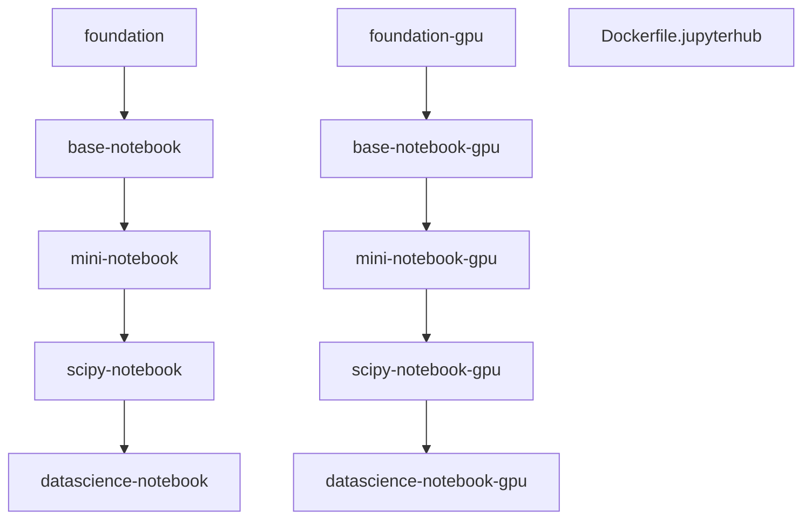

# JupyterHub Dockerfiles

Based on [docker-stacks](https://github.com/jupyter/docker-stacks)

## Variants

- `foundation` - Ubuntu 22.04 base with the `jovyan` user, micromamba/conda and
  SUSTech mirrors.
- `base-notebook` - Jupyter Notebook, Lab and Hub on top of `foundation`.
- `mini-notebook` - adds OS utilities and TeX tooling.
- `scipy-notebook` - adds the scientific Python stack (NumPy, SciPy, pandas,
  scikit-learn, matplotlib, etc.).
- `datascience-notebook` - adds Julia, R and code-server as the built-in
  WebIDE.
- `foundation-gpu` - NVIDIA CUDA base instead of Ubuntu; otherwise mirrors
  `foundation`.
- `base-notebook-gpu`, `mini-notebook-gpu`, `scipy-notebook-gpu`,
  `datascience-notebook-gpu` - the GPU counterparts of the CPU chain.
- `Dockerfile.jupyterhub` - the JupyterHub hub image itself, standalone from the
  notebook chains.

## jupyterlab-cpu

1. "System": change to SUSTech's mirrors; change default username from `jovyan` to `bayes`
2. "Julia": Change to SUSTech's mirrors
3. "WebIDE": Add code-server as the built-in webIDE

## jupyterlab-gpu
1. "System": the `BASE_CONTAINER` change to
