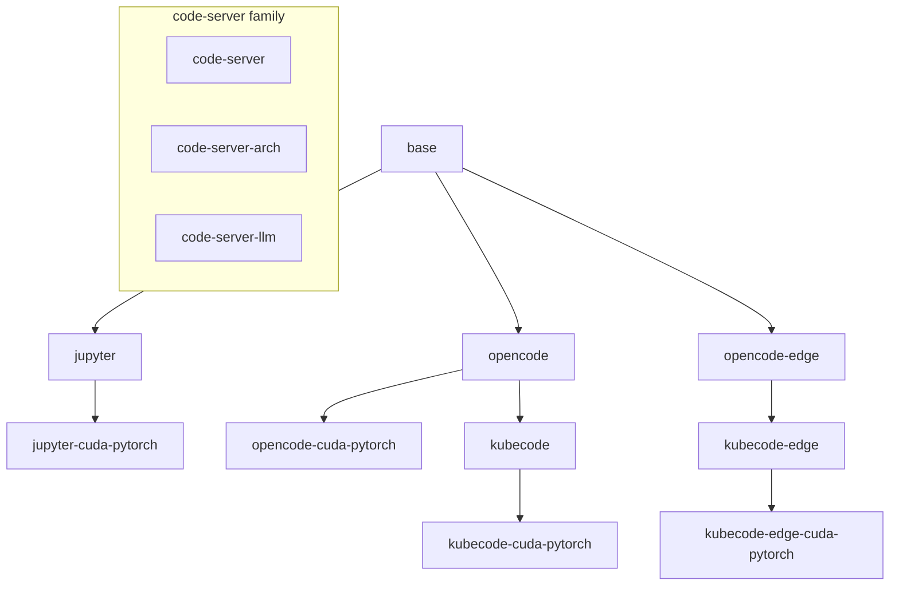

# Kubeflow Containers Images

## Architecture


## Variants



- `base` - the Ubuntu 24.04 base image with s6, kubectl, conda/miniforge and the
  `jovyan` user. Everything below it inherits from this image.
- `jupyter` - JupyterLab + Notebook on top of `base`.
- `jupyter-cuda-pytorch` - `jupyter` plus the pinned CUDA builds of PyTorch,
  torchaudio and torchvision. An alternate `Dockerfile.openvscode-server` in the
  same directory additionally bundles OpenVSCode Server.
- `opencode` - the forked OpenCode Web server and GitHub CLI on top of `base`.
- `opencode-cuda-pytorch` - `opencode` plus the pinned CUDA PyTorch stack.
- `kubecode` - `opencode` with Kubecode, Bubblewrap, GitHub CLI, and bundled
  OpenCode, Codex and Claude Code CLIs as ACP agents.
- `kubecode-cuda-pytorch` - `kubecode` plus the pinned CUDA PyTorch stack.
- `kubecode-edge` - the pinned Kubecode release with the latest stable
  OpenCode, Codex and Claude Code versions resolved by automation.
- `kubecode-edge-cuda-pytorch` - `kubecode-edge` plus the pinned CUDA PyTorch
  stack.
- `code-server`, `code-server-arch`, `code-server-llm` - a sibling family of
  standalone development images with GitHub CLI. They share the same
  code-server + uv + s6 layout but each is built directly from its own external
  base image (Ubuntu, Arch Linux and NVIDIA CUDA respectively), so they have no
  image inheritance between them nor from the repo `base` image.

Version pins live in `../versions/kubeflow.env`. The `code-server-llm` image is
built as a matrix from `../versions/code-server-llm-matrix.json`.

## Build

```bash
make -C . build-base
make -C . build-jupyter-cuda-pytorch
make -C . build-opencode
make -C . build-opencode-cuda-pytorch
make -C . build-kubecode
make -C . build-kubecode-cuda-pytorch
make -C . build-kubecode-edge
make -C . build-kubecode-edge-cuda-pytorch
make -C . build-code-server
make -C . build-code-server-arch
make -C . build-code-server-llm
```

See the repo root `README.md` and the GitHub Actions workflows
(`.github/workflows/kubeflow-images.yml`, `kubeflow.yaml`) for the full image
set, tag naming and CI behavior.
