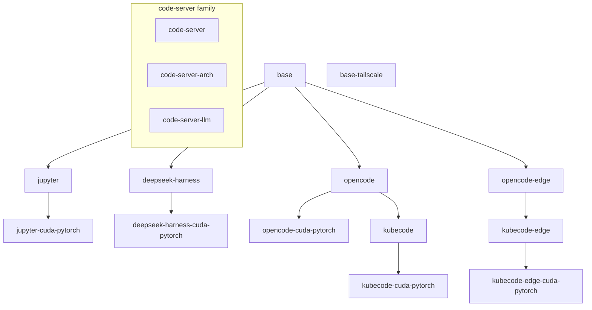

# Kubeflow Containers Images

## Architecture


## Variants


```mermaid
graph TD
    base[base] --> jupyter[jupyter]
    base_tailscale[base-tailscale]
    jupyter --> jupyter_cuda[jupyter-cuda-pytorch]
    base --> deepseek_harness[deepseek-harness]
    deepseek_harness --> deepseek_harness_cuda[deepseek-harness-cuda-pytorch]
    base --> opencode[opencode]
    opencode --> opencode_cuda[opencode-cuda-pytorch]
    opencode --> kubecode[kubecode]
    kubecode --> kubecode_cuda[kubecode-cuda-pytorch]
    base --> opencode_edge[opencode-edge]
    opencode_edge --> kubecode_edge[kubecode-edge]
    kubecode_edge --> kubecode_edge_cuda[kubecode-edge-cuda-pytorch]
    subgraph cs["code-server family"]
        code_server[code-server]
        code_server_arch[code-server-arch]
        code_server_llm[code-server-llm]
    end
```

- `base` - the Ubuntu 24.04 base image with s6, kubectl, conda/miniforge and the
  `jovyan` user. Everything below it inherits from this image.
- `base-tailscale` - a standalone Ubuntu 24.04 image with Tailscale, Node.js/npm,
  Bubblewrap, sudo, and an enabled OpenSSH server. It uses the `ubuntu` user with
  password `ubuntu` and does not inherit from `base`.
- `jupyter` - JupyterLab + Notebook on top of `base`.
- `jupyter-cuda-pytorch` - `jupyter` plus the pinned CUDA builds of PyTorch,
  torchaudio and torchvision. An alternate `Dockerfile.openvscode-server` in the
  same directory additionally bundles OpenVSCode Server.
- `deepseek-harness` - the pinned DeepSeek Harness Web UI on top of `base`.
  Harness remains bound to loopback; an nginx compatibility proxy exposes port
  8888 and rewrites its root-relative frontend, plugin, API, WebSocket and PWA
  paths for Kubeflow's `NB_PREFIX`. Its complete `DSH_HOME` lives on the user
  PVC under `/home/jovyan/srv/.state/deepseek-harness`.
- `deepseek-harness-cuda-pytorch` - `deepseek-harness` plus the pinned CUDA
  PyTorch stack and NVIDIA runtime capability declarations.
- `opencode` - the forked OpenCode Web server and GitHub CLI on top of `base`.
- `opencode-cuda-pytorch` - `opencode` plus the pinned CUDA PyTorch stack.
- `kubecode` - `opencode` with Kubecode, Bubblewrap, GitHub CLI, and bundled
  OpenCode, Codex and Claude Code CLIs as ACP agents.
- `kubecode-cuda-pytorch` - `kubecode` plus the pinned CUDA PyTorch stack.
- `kubecode-edge` - the pinned Kubecode release with the latest stable
  OpenCode, Codex and Claude Code versions resolved by automation.
- `kubecode-edge-cuda-pytorch` - `kubecode-edge` plus the pinned CUDA PyTorch
  stack.
- `code-server`, `code-server-arch`, `code-server-llm` - a sibling family of
  standalone development images with GitHub CLI. They share the same
  code-server + uv + s6 layout but each is built directly from its own external
  base image (Ubuntu, Arch Linux and NVIDIA CUDA respectively), so they have no
  image inheritance between them nor from the repo `base` image.
`base-tailscale` starts both `tailscaled` and `sshd` when the container starts.
Set `TS_AUTHKEY` to authenticate automatically and persist `/var/lib/tailscale`
if the node identity should survive restarts. The default `TS_USERSPACE=true`
works without `/dev/net/tun`; set `TS_USERSPACE=false` only when the container
has `/dev/net/tun` and the required network capabilities. For example:

```bash
docker run -d --name base-tailscale \
  -e TS_AUTHKEY=tskey-... \
  -v base-tailscale-state:/var/lib/tailscale \
  -p 2222:22 \
  terencelau/kubeflow:latest-base-tailscale
```

The image intentionally keeps the requested default `ubuntu` / `ubuntu`
password. Change it before exposing SSH beyond a controlled environment.


Version pins live in `../versions/kubeflow.env`. The `code-server-llm` image is
built as a matrix from `../versions/code-server-llm-matrix.json`.

## Build

```bash
make -C . build-base
make -C . build-base-tailscale
make -C . build-jupyter-cuda-pytorch
make -C . build-deepseek-harness
make -C . build-deepseek-harness-cuda-pytorch
make -C . build-opencode
make -C . build-opencode-cuda-pytorch
make -C . build-kubecode
make -C . build-kubecode-cuda-pytorch
make -C . build-kubecode-edge
make -C . build-kubecode-edge-cuda-pytorch
make -C . build-code-server
make -C . build-code-server-arch
make -C . build-code-server-llm
```

See the repo root `README.md` and the GitHub Actions workflows
(`.github/workflows/kubeflow-images.yml`, `kubeflow.yaml`) for the full image
set, tag naming and CI behavior.
