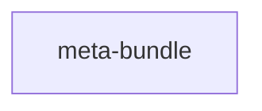

# meta-bundle

`terencelau/meta-bundle` packages the Mihomo core and the zashboard static web
UI in one container. The bundled default configuration starts a mixed proxy on
port `7890` and serves the controller and dashboard on port `9090`.

## Variants



`meta-bundle` is a single-variant image. Its build stage downloads the
zashboard web UI (pinned by `ZASHBOARD_VERSION` and `ZASHBOARD_SHA256`) and
copies it into the pinned `metacubex/mihomo` runtime image.

## Quick start

```bash
docker run -d \
  --name meta-bundle \
  --restart unless-stopped \
  -p 7890:7890 \
  -p 9090:9090 \
  -v meta-bundle-data:/root/.config/mihomo \
  terencelau/meta-bundle:latest
```

Open `http://localhost:9090/ui/`. The default API secret is empty.

When the data volume does not contain `config.yaml`, the entrypoint initializes
it from the bundled default. Existing configuration is never overwritten unless
subscription updates are enabled as described below.

## Docker Compose

```yaml
services:
  meta-bundle:
    image: terencelau/meta-bundle:latest
    container_name: meta-bundle
    restart: unless-stopped
    ports:
      - "7890:7890"
      - "9090:9090"
    volumes:
      - meta-bundle-data:/root/.config/mihomo

volumes:
  meta-bundle-data:
```

## Subscription updates

If a subscription URL returns a complete Mihomo YAML configuration, set
`SUBSCRIPTION_URL` to download it before Mihomo starts and refresh it every six
hours:

```yaml
services:
  meta-bundle:
    image: terencelau/meta-bundle:latest
    container_name: meta-bundle
    restart: unless-stopped
    ports:
      - "7890:7890"
      - "9090:9090"
    environment:
      SUBSCRIPTION_URL: "https://example.com/subscription"
      SUBSCRIPTION_INTERVAL: "21600"
    volumes:
      - meta-bundle-data:/root/.config/mihomo

volumes:
  meta-bundle-data:
```

`SUBSCRIPTION_INTERVAL` is measured in seconds. Set it to `0` to download only
at container startup. `SUBSCRIPTION_USER_AGENT` optionally overrides the HTTP
user agent, which defaults to `meta-bundle/mihomo`.

For Docker secrets, put only the URL in a file and set `SUBSCRIPTION_URL_FILE`
to its container path instead of setting `SUBSCRIPTION_URL`. The two variables
cannot be used together.

Each downloaded configuration is tested by Mihomo before it atomically replaces
`config.yaml`. Invalid or failed updates leave the current configuration in use,
and the replaced configuration is retained as `config.yaml.previous`. A changed
configuration is hot-reloaded without restarting the container. If the first
download fails and the data volume has no cached configuration, the container
exits instead of starting with the direct-only default.

The dashboard directory and controller address are applied as image-level Mihomo
overrides, so a subscription configuration does not need to contain
`external-ui` or `external-controller`. Override
`CLASH_OVERRIDE_EXTERNAL_UI_DIR` or `CLASH_OVERRIDE_EXTERNAL_CONTROLLER` if
different values are required.

## Custom configuration

Mount a directory instead of the named volume:

```bash
docker run -d \
  --name meta-bundle \
  --restart unless-stopped \
  -p 7890:7890 \
  -p 9090:9090 \
  -v "$PWD/mihomo:/root/.config/mihomo" \
  terencelau/meta-bundle:latest
```

An empty directory is initialized automatically. The image applies these Mihomo
settings as environment-based overrides, so a custom configuration does not
need to include them:

```yaml
external-controller: 0.0.0.0:9090
external-ui: /usr/share/zashboard
```

Set `CLASH_OVERRIDE_EXTERNAL_CONTROLLER` or
`CLASH_OVERRIDE_EXTERNAL_UI_DIR` on the container to change either value.

The image also accepts additional Mihomo CLI flags after the image name.

## TUN mode

TUN requires a custom configuration that enables `tun`. A typical Linux launch
uses host networking and grants access to the TUN device:

```bash
docker run -d \
  --name meta-bundle \
  --restart unless-stopped \
  --network host \
  --cap-add NET_ADMIN \
  --device /dev/net/tun \
  -v meta-bundle-data:/root/.config/mihomo \
  terencelau/meta-bundle:latest
```

## Build

Pinned versions are stored in `../versions/meta-bundle.env`.

```bash
make build
make build TARGETPLATFORM=linux/arm64
make push REGISTRY_PREFIX=docker.io/your-name
```

When overriding `ZASHBOARD_VERSION`, also provide the matching
`ZASHBOARD_SHA256`.
