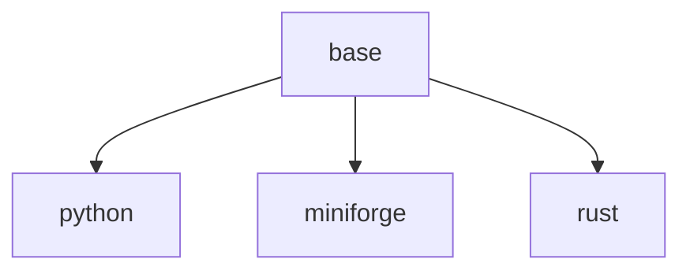

# OpenVSCode Server Images

## Variants

- `base` - the OpenVSCode Server image on `buildpack-deps:22.04-curl`, serving
  the browser IDE on port 3000 under the `jovyan` user, with GitHub CLI as part
  of its standard development toolset.
- `python` - extends `base` with system Python and `pixi`.
- `miniforge` - extends `base` with a Miniforge conda install at `/opt/conda`.
- `rust` - extends `base` with the Rust toolchain (rustup, rustfmt, clippy).

Versions are configurable through `VSCODE_VERSION` and `MINIFORGE_VERSION` (see
the `Makefile` and `.github/workflows/openvscode.yaml`).
